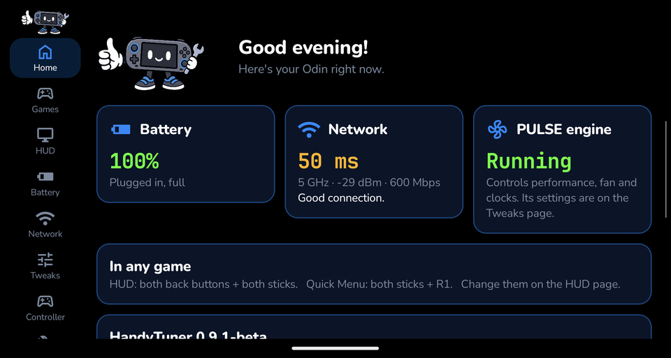

<p align="center"></p>

# HandyTuner

**One app to tune your Android gaming handheld:** a game HUD, a Quick Menu you open from inside any game, per-game
presets, and the PULSE performance engine built in. Meet HandyHelper, who walks you through setup.

Made and tested on the **AYN Odin 2 Portal** first, with **support for more handhelds planned**: see
[Supported devices](#supported-devices).

> [!NOTE]
> **Honest heads-up: HandyTuner is vibe-coded.** I build it with AI (Claude), and half the time I don't fully know
> what I'm doing — but I'm learning as I go. I test everything on my own Odin 2 Portal before it ships, but expect
> rough edges. Bug reports, tips and code help are all very welcome!

> [!WARNING]
> **Beta (0.9.2). So far everything has been tested on the AYN Odin 2 Portal (Android 13) only.**
> Other devices aren't tested yet: on them it may not work, or may change settings it shouldn't. If you try it on
> another device, please open an issue with the result and an exported log (Diagnostics → Export log file) — that's
> exactly how support for more devices gets added. "Reset everything to stock" (Diagnostics) puts back what
> HandyTuner changed.

## What it does

<p align="center"></p>

- **HUD** over your games: FPS, CPU/GPU load and temperature, battery time left, ping, refresh rate.
- **Quick Menu** (both sticks + R1): performance mode, AutoTDP and its FPS target, frame cap (30/40/60), fan,
  presets, brightness, volume, refresh rate, screenshots, screen recording, AFK mode and Speed Up.
- **Per-game presets**: Battery, Optimal, Performance, Competitive, or your own. Applied automatically when a
  game opens, including Windows games in GameNative. Export and import them as a file.
- **PULSE engine**: power tiers, AutoTDP, frame caps, fan control including **Hold temp** (keeps the chip at a
  temperature you choose, never above 88 °C), **sleep underclock** while the screen is off, and **stick lights**.
- **Battery**: charge limit and play-while-charging, using AYN's own charging switch.
- **Network**: connection test, Low Latency mode, a DNS benchmark and one-tap Private DNS.
- **Controller**: key mapping.
- **Diagnostics**: every permission at a glance, and **Export log file** for bug reports.
- **Safe mode** and **Reset everything to stock** put your device back if anything goes wrong.

📖 **[Read the full user guide](docs/USER_GUIDE.md)**: every page and feature explained, plus FAQ and troubleshooting.

## Supported devices

| Device | Status |
|---|---|
| **AYN Odin 2 Portal** | ✅ Tested: everything in this README works. |
| **AYN Odin 3** | ⚠️ Untested. The PULSE engine already has a profile for its chip, but HandyTuner hasn't been tried on it. |
| **AYN Thor** | ⚠️ Untested. The PULSE engine already has a profile for its chip, but HandyTuner hasn't been tried on it. |
| **Retroid Pocket 6** | ⚠️ Untested. The PULSE engine already has a profile for its chip, but HandyTuner hasn't been tried on it. |
| **Other AYN and Retroid handhelds** | 🔜 Planned. HandyTuner checks what each device supports, but each one needs testing. |

Want your device supported sooner? Try it and [open an issue](https://github.com/ElectricBits/HandyTuner/issues/new/choose)
with your device and the log from **Diagnostics → Export log file**, or say hi on [Discord](https://discord.gg/uGQQ2n36QR).

## Install

<a href="https://apps.obtainium.imranr.dev/redirect?r=obtainium://app/%7B%22id%22%3A%22com.electric.handytuner%22%2C%22url%22%3A%22https%3A%2F%2Fgithub.com%2FElectricBits%2FHandyTuner%22%2C%22author%22%3A%22ElectricBits%22%2C%22name%22%3A%22HandyTuner%22%2C%22additionalSettings%22%3A%22%7B%5C%22includePrereleases%5C%22%3A%20true%7D%22%7D"></a>

**With [Obtainium](https://github.com/ImranR98/Obtainium)** (gets updates automatically): tap the badge on the Odin,
or add `https://github.com/ElectricBits/HandyTuner` in Obtainium and turn on **Include prereleases**.

**Or by hand:**

1. Download the latest `HandyTuner-<version>.apk` from [Releases](https://github.com/ElectricBits/HandyTuner/releases).
2. Open it on the Odin and allow installing from that app when Android asks.
3. Open HandyTuner and follow HandyHelper's setup.

No root is needed: HandyTuner uses the system service AYN builds into the Odin.

**Uninstalling?** Run **Diagnostics → Reset everything to stock** first, so settings like the charge limit are put back.

### Permissions, and why

| Permission | Why |
|---|---|
| Accessibility service | Draws the HUD and Quick Menu over games and reads the button combos that open them. Android 13 grays this switch out for apps installed from outside the Play Store until you tap **Allow restricted settings** on HandyTuner's App info page; setup shows you how. |
| Usage access | Knows which game is in front, to apply its preset. |
| Notifications | The status notification and short notices (screenshots saved, preset applied). |
| Query all packages | Lists your games and finds a game's network connection for the ping reading. |

HandyTuner also turns off **Odin Assistant's game detection** by default, because it changes performance per
game and fights HandyTuner. Only that one accessibility service is switched off; the app stays. You can turn
this off on the **Tweaks** page.

## Privacy

No accounts, ads, analytics or tracking. HandyTuner sends nothing about you anywhere. It only uses the network
when you ask: the Network test, the DNS benchmark (your own DNS and a fixed list of well-known providers), and
links you tap. Logs stay on your device unless you export and share them.

## Build from source

Needs JDK 17 and the Android SDK.

```sh
./gradlew testDebugUnitTest assembleDebug
```

The APK is in `app/build/outputs/apk/debug/`. Release builds are signed with the author's key, which is not
part of this repository.

## Help improve HandyTuner

- **Found a bug, or tried it on another device?** Open an [issue](https://github.com/ElectricBits/HandyTuner/issues/new/choose)
  and attach the log from **Diagnostics → Export log file**.
- **Want to send code?** Fork the repo and open a pull request. [`CONTRIBUTING.md`](CONTRIBUTING.md) explains how, and
  [`CODE_OF_CONDUCT.md`](CODE_OF_CONDUCT.md) covers how we treat each other.
- **Found a security problem?** Please report it privately: see [`SECURITY.md`](SECURITY.md).
- **Questions, ideas, presets, or just hanging out?** Join the [HandyHelper Realm Discord](https://discord.gg/uGQQ2n36QR).

## Support

HandyTuner is free and always will be. If it helps you, you can buy me a coffee on
[Ko-fi](https://ko-fi.com/electricbits) — there's also a button in the app's About card. Thank you!

## License

Copyright (C) 2026 ElectricBits. HandyTuner is free software under the **GNU General Public License, version 2
only** (`GPL-2.0-only`, see [`LICENSE`](LICENSE)). It comes with
**no warranty**: it changes performance, fan, display and network settings, so use it at your own risk.

It includes the engine of [PULSE](https://github.com/keiretrogaming/pulse), copyrighted by keiretrogaming and its
contributors and used under the GPL, which builds on
[ClusterTune](https://github.com/AurelioB/cluster-tune) and [O2P Tweaks](https://github.com/FeralAI/o2ptweaks.app).
Credits, fonts, icons and the full list of changes are in [`NOTICE.md`](NOTICE.md) and
[`pulse/NOTICE.md`](pulse/NOTICE.md).

HandyTuner is an independent project. It is not made by, affiliated with or endorsed by AYN, and it is not the
official PULSE.
