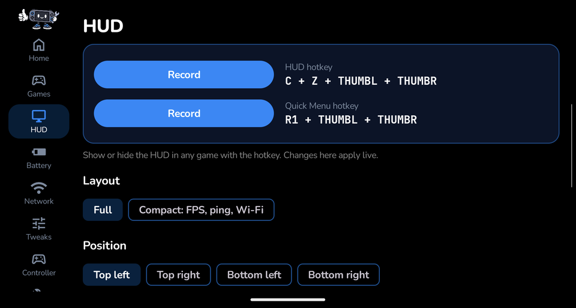
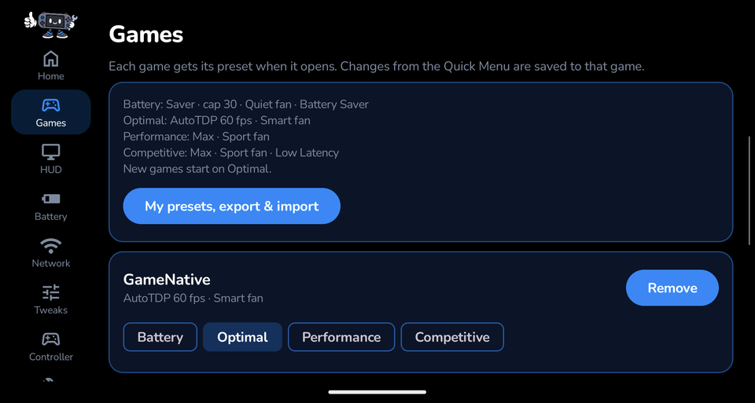
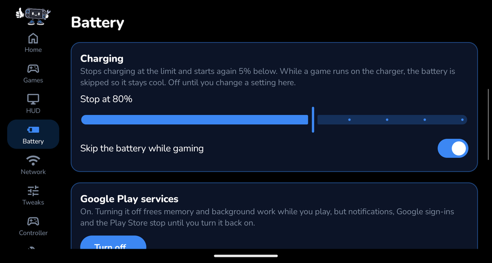
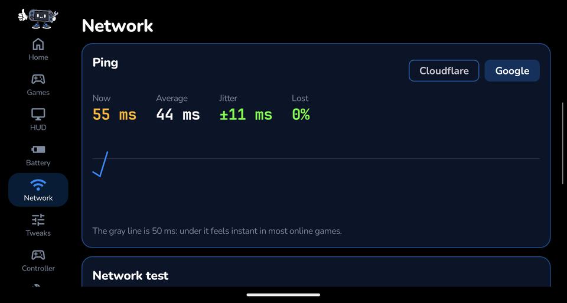
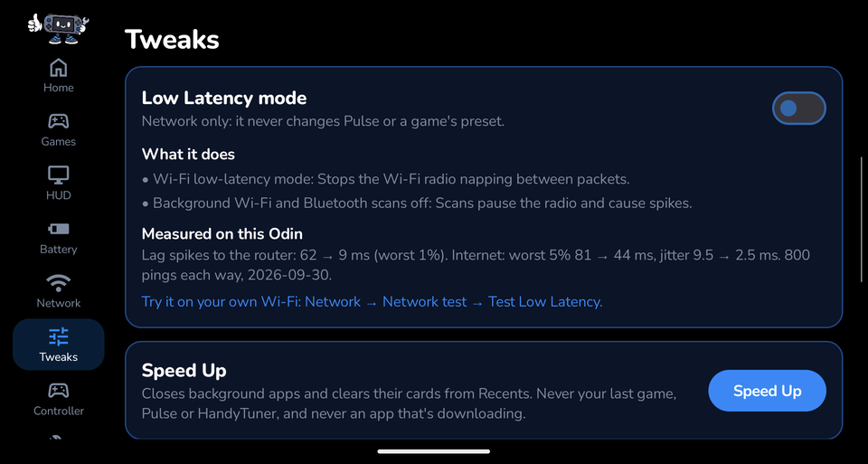

# HandyTuner user guide

Everything HandyTuner does, page by page, in plain words. HandyTuner is a beta tested on the **AYN Odin 2 Portal
(Android 13)** only.

**Contents:** [Setup](#setup) · [Hotkeys](#hotkeys) · [Home](#home) · [Quick Menu](#quick-menu) · [HUD](#hud) ·
[Games and presets](#games-and-presets) · [Battery](#battery) · [Network](#network) · [Tweaks](#tweaks) ·
[Controller](#controller) · [Dock & TV](#dock--tv) · [Diagnostics](#diagnostics) · [Safety](#safety-safe-mode-and-reset) · [FAQ](#faq-and-troubleshooting)

---

## Setup

The first time you open HandyTuner, **HandyHelper** walks you through setup. Press **A** to move on and **B** to go back.

He asks for three permissions. Each step has a button that opens the right page in Android's Settings:

| Permission | What HandyTuner uses it for |
|---|---|
| **Accessibility service** ("Overlay & hotkeys") | Drawing the HUD and Quick Menu over games, and noticing the button combos that open them. |
| **Usage access** | Knowing which game is in front, so it can apply that game's preset. |
| **Notifications** | The status notification, and short notices like "screenshot saved". |

> **Accessibility switch grayed out?** Android 13 locks it for apps installed from outside the Play Store. Open
> **Settings → Apps → HandyTuner**, tap **⋮ → Allow restricted settings**, then go back and switch it on. Setup
> offers a button for this.

Then he checks that the Odin's built-in system service answers (that's how HandyTuner works without root), offers
**Cocoon** (a launcher that tells HandyTuner exactly which game you start, even Windows games), lets you pick the HUD's
color, and has you try both hotkeys. You can run setup again any time from **Diagnostics → Run setup again**.

---

## Hotkeys

| Hotkey | What it does |
|---|---|
| **Both back buttons + both sticks pressed in** | Show or hide the HUD |
| **Both sticks pressed in + R1** | Open the Quick Menu |

They work in any game, on the Odin's own buttons or an external controller whose back paddles send the same
buttons (an 8BitDo's do). Change them on the **HUD** page (**Record**, then press your new combo).

---

## Home

Your Odin at a glance: battery level and how long it will last at the current rate, your Wi-Fi ping and signal, and
whether the PULSE engine is running. Tap HandyHelper and he moonwalks.

At the bottom, the **About** card shows the version, the license, and buttons for the **Source code**, **Licenses**,
**Discord** and **Ko-fi**.

---

## Quick Menu

Open it in any game with **both sticks + R1**. Changes apply to the game in front and are saved for that game.

| Tile | What it does |
|---|---|
| **Performance & Fan** | Pick **Auto** (AutoTDP holds an FPS target, 30, 40, 60 or 120, at the lowest power it can) or a fixed power level: **Max**, **Balanced** or **Saver**. With a fixed level you can add a **frame cap** (30, 40 or 60 FPS). Pick the fan: **Quiet**, **Smart**, **Sport** or **Hold temp**. Live CPU temperature and fan speed are shown. |
| **Preset** | Switch this game to another preset in one tap (see [Games and presets](#games-and-presets)). |
| **Quick settings** | Brightness, volume, refresh rate (60 or 120 Hz), **Screenshot** and screen **Record**. Screenshots go to *Pictures › HandyTuner*, recordings to *Movies › HandyTuner*. |
| **HUD** | Show or hide the HUD. |
| **AFK Mode** | Stepping away mid-game? Dims the screen and locks the buttons so nothing gets pressed. |
| **Key Mapping** | Turn your key map on or off for this game (see [Controller](#controller)). |
| **A/B Buttons** | Swap which face button is A. |
| **Speed Up** | Closes background apps to free memory (never your game, and never an app that's downloading). |
| **Pulse settings** | Opens the engine settings on the Tweaks page. |

---

## HUD

The HUD floats over your game. **Full** shows FPS, refresh rate, CPU and GPU load, CPU and GPU temperature, RAM,
battery time left, ping (to the game's server when HandyTuner can find it, and to the internet), Wi-Fi signal, the
time, and a one-line hint about what's slowing the game down. What the hint line can say:

| Hint | Meaning |
|---|---|
| Running smoothly | Nothing is holding the game back. |
| Steady at 60 fps | The game sits at a rate it chose itself (often its own frame limit). |
| Holding your 40 fps cap / Auto is holding 30 fps | Your cap or Auto target is working. |
| The graphics chip is the limit right now | The GPU is fully busy; a lighter setting or Saver may help battery. |
| One CPU core is the limit right now | The game's main thread is fully busy (common in emulators). |
| Memory is running low *(amber)* | Close background apps (Tweaks → Speed Up). |
| The chip is slowing down to cool off *(amber)* | Real heat throttling, read from the system, not guessed from the temperature. | **Compact** shows just FPS, ping and Wi-Fi.

On the HUD page you can also change the **hotkeys**, the HUD's **position** (any corner), **size** and **accent
color**. Changes apply live.

---

## Games and presets

Every game you play shows up here with its **preset**. When a game opens, HandyTuner applies its preset
automatically. It works for Windows games in GameNative too, where each `.exe` gets its own preset.

| Preset | What it sets |
|---|---|
| **Battery** | Saver power level, 30 FPS cap, Quiet fan, plus HandyTuner's battery saver: screen at most 35% brightness, no background Wi-Fi/Bluetooth scans, background apps closed |
| **Optimal** | AutoTDP at 60 FPS, Smart fan. **New games start here.** |
| **Performance** | Max power level, Sport fan |
| **Competitive** | Max power level, Sport fan, plus Low Latency Wi-Fi |

Changes you make in the Quick Menu are saved to that game, and it's then shown as "(tweaked)".

**My presets, export & import:** make your own presets (power level or AutoTDP, frame cap, fan, and a battery or
network part), and share them as a file in your Downloads folder. Importing never overwrites your own presets or games.

---

## Battery

- **Charge limit:** stops charging at the level you pick (default 80%) and starts again 5% below. Keeping the battery
  away from 100% helps it last longer. It uses AYN's own charging switch.
- **Skip the battery while gaming:** while a game runs on the charger, power goes straight to the Odin instead of
  through the battery, so the battery stays cool.
- **Google Play services:** turn them off while you play to free memory and background work. Notifications, Google
  sign-ins and the Play Store stop until you turn them back on.
- **Play sessions:** your recent gaming sessions, newest first.

---

## Network

- **Ping:** live ping to Cloudflare or Google, with average, jitter (how jumpy it is) and lost packets. Under the gray
  50 ms line feels instant in most online games.
- **Network test:** measures your connection in about a minute, and can test **Low Latency mode** on your own Wi-Fi
  (about two minutes) so you can see whether it helps you.
- **DNS benchmark:** tests your network's DNS and well-known public providers (Cloudflare, Google, Quad9, AdGuard,
  Mullvad, OpenDNS, Control D), fastest first. A faster DNS makes stores and matchmaking connect sooner; it doesn't
  change in-game ping.
- **Private DNS:** switch to an encrypted DNS provider in one tap, or back to automatic.

---

## Tweaks

| Tweak | What it does |
|---|---|
| **Resolution** | The Odin's screen at **Native**, 90, 85, 80, 75, 67, 60 or 50%, and the TV while docked at **its own**, 1440p, 1080p or 720p. Fewer pixels is less work for the graphics chip, and on a 4K TV about 300 MB less memory. **Keep text and buttons the same size** (on) scales them with it. A running game may pause once when it changes. Also on the **Dock & TV** page; **Reset everything to stock** puts both back. |
| **Low Latency mode** | Wi-Fi only: stops the Wi-Fi radio napping between packets and pauses background Wi-Fi and Bluetooth scans, which cause lag spikes. It never changes performance or presets. |
| **Speed Up** | Closes background apps and clears them from Recents. Never your last game, HandyTuner, or an app that's downloading. |
| **Keep Odin Assistant's game detection off** | Odin Assistant can change performance and fan per game, which fights HandyTuner. On by default; it switches off only that one feature, and the app stays. |
| **Hold temp fan** | The temperature the **Hold temp** fan keeps the chip at (60–88 °C). Lower is cooler and louder. Applies to every preset that uses Hold temp. |
| **AutoTDP style** | **Efficient**, **Balanced** or **Smooth**: how hard AutoTDP saves power while holding your FPS. |
| **Sleep underclock** | Slows the chip while the screen is off, and puts it back when you wake the Odin. |
| **Stick lights** | The lights around the sticks: **Off**, **Battery** (green to red as it drains), **Heat** (blue to red as it warms) or a **Color** and brightness you pick. |

### The PULSE engine

HandyTuner's performance control comes from **PULSE** by keiretrogaming, built in. It runs in the background,
watches which game is in front, and applies its power level, AutoTDP, frame cap and fan. You don't need to install
PULSE separately; installing the separate PULSE app alongside HandyTuner would make the two fight.

---

## Controller

- **Button layout:** **Xbox** (A at the bottom) or **Swapped** (A on the right).
- **Key mapping:** make layouts that turn controller buttons into screen taps (or holds) for Android games without
  controller support. Buttons only: on Android 13 the sticks can't be mapped. Show the layout over the game while you set it up, and export or import layouts as files.
- Shortcuts to the Odin's own **Deadzones, triggers & more** and **Key Test & stick calibration**.

### External controllers (beta)

For Bluetooth, USB or dongle controllers such as 8BitDo and Xbox pads. Tested with an 8BitDo Ultimate 2C over
Bluetooth.

- **Connected controllers:** every controller Android sees, with its brand and battery. **Rumble test** checks the
  motor. If the Odin's own controls are ever listed as an external controller, press **This isn't a controller**.
- **Button & stick test:** press any button (back paddles too) to see what it sends. With the sticks let go they
  should read close to 0.00; more than 0.10 means drift. 8BitDo pads send different buttons in different modes, so
  check here if A/B come out swapped.
- **Button shortcuts:** give a button a HandyTuner action (Quick Menu, HUD, screenshot, recording, next preset, Speed
  Up, AFK, **go to the home screen**, **go back**). In games that button does the action and the game doesn't see
  it. Shortcuts are off on HandyTuner's own screens, so the button test still works there.
  - **Go to the home screen** suits a controller's Home button. Docked to a TV, the TV goes home too. It acts when
    you let go: **hold it and press Select** to go back instead (the Select never reaches the app). Some launchers,
    Cocoon among them, ignore Android's Back in their own menus; use B there.
- **When a controller is connected:** a preset for every game, **Ignore the Odin's own buttons** (buttons only, the
  hotkeys still work), hide the key-mapping markers, and alerts when the controller disconnects mid-game or its
  battery drops to 20% and 10%.
- **Key layouts per controller:** a key-mapping layout made while an external controller is connected is saved for
  the controller, so it can differ from the Odin's own.
- The HUD can show the **controller battery** (HUD page → What the HUD shows).

---

## Dock & TV

HandyTuner counts the Odin as **docked** when a TV or monitor is plugged in (or, if you switch it on, when any
charger is: the ODIN Station without a TV only shows up as a charger). Docked with a controller is **Couch mode**. It switches within a few seconds, and switches back when you
undock.

- **Presets:** one for docked and one for couch. They go over each game's own preset while docked; the game's own
  comes back when you undock.
- **Resolution** for the TV (its own, 1440p, 1080p or 720p), the same card as on the Tweaks page.
- With a TV, the **HUD** and the **Quick Menu** open on the TV, and the game is the app on the TV (so presets and
  the Quick Menu follow it, not the home screen on the Odin's own screen).
- **TV-size HUD**, **Dim the Odin's screen**, **Keep the screen awake** and **Pause sleep underclock** while docked.
  Each is put back when you undock.
- **Charging while docked:** its own charge limit, so a docked Odin doesn't sit at 100%.
- **Open an app when docked:** a game or launcher to open when you dock.

---

## Diagnostics

- **Permissions & access:** every permission HandyTuner needs, with a ✅ or a button to fix it.
- **Apps HandyTuner works with:** the PULSE engine's status, and whether Cocoon is installed.
- **Run setup again** and **Export log file** (saves HandyTuner's own log to Downloads for bug reports; it contains
  nothing from your other apps).

---

## Safety: safe mode and reset

- **Reset everything to stock** (Diagnostics) puts back every setting HandyTuner changed: brightness, refresh rate,
  scanning, Private DNS, button layout, charging, stick lights, sleep underclock, frame caps and the engine's defaults.
- **Safe mode** turns on by itself if HandyTuner's overlay keeps crashing (3 restarts in 10 minutes). It puts your
  device back and stops HandyTuner changing anything until you clear it on the Diagnostics page.
- **Uninstalling:** run **Reset everything to stock first**. Uninstalling skips the clean-up, so settings like the
  charge limit would stay on.

---

## FAQ and troubleshooting

**Does it need root?** No. It uses the system service AYN builds into the Odin.

**Does it work on my device?** It's only tested on the Odin 2 Portal. On anything else HandyTuner shows a warning on
Home. If you try it, please [open an issue](https://github.com/ElectricBits/HandyTuner/issues/new/choose) with your
device and the log from **Diagnostics → Export log file**.

**The hotkeys or HUD stopped working.** Android turns the accessibility service off after some updates. Check
**Diagnostics → Overlay & hotkeys** and switch it back on.

**Performance controls say the engine isn't answering.** Check **Diagnostics → PULSE engine**. If its watcher is asleep,
give HandyTuner **Usage access**.

**My stick lights don't change color.** Pick a mode on the Tweaks page; HandyTuner switches the lights on itself. If
you also use AYN's own LED tile, choose a solid effect there, because animated effects override the color.

**What's the difference between the Smart and Hold temp fans?** **Smart** is AYN's own automatic fan. **Hold temp** is
PULSE's fan, which aims for the exact temperature you set on the Tweaks page.

**Something went wrong.** Use **Diagnostics → Reset everything to stock**, then tell us on
[Discord](https://discord.gg/uGQQ2n36QR) or in an [issue](https://github.com/ElectricBits/HandyTuner/issues).
